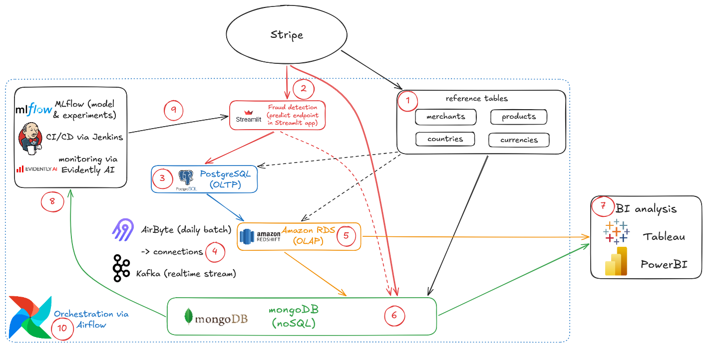

Welcome to my take on Jedha's data architecture project, based on Stripe! The objective is to build a transactional data infrastructure. Let's dive right in then!

Let's first introduce our technical stack: we will use Apache's Airflow as our orchestrator for the entire infrastructure. Streamlit will allow us to make a fraud detection application, providing a "predict" endpoint through which the transaction data could be run & analyzed; the model behind it would be extracted from our best experiment in MLflow, for which the CI/CD would be enabled thanks to Jenkins while Evidently AI would monitor the data drift.

Going down the data flow, we would run our OLTP on a PostgreSQL server, paired for our OLAP with Amazon Redshift. The connections when transferring data batches would be handled by Airbyte, whereas realtime data streaming would instead be ensured through Apache's Kafka; finally our noSQL receiving all this data would be run on mongoDB! This will enable our analytical teams to run their queries through the tool of their choice on our data warehouse, such as Tableau or PowerBI, or to complement informations not included in RDS by querying our mongoDB.

Now to understand the flow in the architecture, let's develop the concept by following the schema's ten points:

1. First of all and as stated by our instructions, we have shared data accross all systems. Those are merchant data, product catalogs, countries & regions, and finally currencies & their exchange rates. Hence the duplication over several systems in our architecture; although nearly all of this data is expected to remain in a near static state, one element that would require more frequent updates thanks to our orchestrator would be the exchange rates for currencies - an expected requirement in our instructions.

2. Then our data begins flowing into our system; a new transaction is generated with Stripe. The signal is thus sent in different states thanks to our pipelines into two components of our architecture: the core transactional elements fitting our OLTP are first ingested by our fraud detection app, to evaluate whether the transaction seems legitimate or not. Although this can cause a latency bottleneck depending the state of the app (restarting, updating...) our components downstream, the OLTP & OLAP, have ACID properties: Atomicity, Consistency, Isolation & Durability. We don't want them to ingest partial data, so we must make sure our app has scalable resources to meet operational needs.

    On the other side of this flow leading straight to the noSQL, the largest elements such as logs that couldn't be reasonably handled by our OLTP are sent on their own to MongoDB; it would also be fed by the fraud detection app by providing the model's features for later exploration by our teams if needed. Duplication of the transaction ID in mongoDB enables the later retrieval and unification of data on this single key.

3. Now let's focus on what the OLTP, our PostgreSQL receives: it is fed straight by the fraud detection app. All parameters (which will be ) are run through it for analysis, only creating the OLTP rows once a result is produced. While decoupling the fraud analysis from OLTP ingestion sounds possible (ingestion as-is into OLTP, & fraud analysis queued for later writing on OLTP) to ensure optimal latency in running transactions, the design choice here is to still risk a slower or even disrupted service to give priority to protecting customers from frauds.

4. Let's discuss our connections now: all along the data flow, two tools would manage transferring informations. The first of them is Airbyte, optimized for the transfer of data by batches: it could operate on a daily basis thanks to Airflow's orchestration. As our upstream OLTP content is already complete, this would prevent oversight of possible frauds by sending incomplete data to the OLAP. On the other hand, real-time data streaming would be enabled by Kafka, again providing a complete information given the upstream flow.

5. While our OLTP is optimized for writing, our data analysts need a dedicated component for their work: that is the OLAP! Amazon's Redshift will serve well their needs as the data warehouse of our system, which is optimized for reading. It would receive the OLTP data according to the upstream connection (either a batch, either from streaming) to enable the production of business insights, although as a reminder, some elements remain outside the OLTP/OLAP since they're stored by the noSQL!

6. And now for our mongoDB! Because it relies on BASE properties (Basically Available, Soft-state, Eventually consistent) it is set at the end of our data flow for the sake of its availability, "Eventually inheriting" the trustworthiness of the ACID components upstream while being horizontally scalable, unlike our OLTP/OLAP which could only scale vertically at a higher cost. Such a setup enables a hybrid system mimicking the HTAP "Hybrid Transactional/Analytical Processing", answering agile business practices; it is further enriched by the data the logs that couldn't be reasonably ingested by the upstream components.

7. What of our BI teams then? Having both the OLAP (data warehouse) and noSQL at their disposal, they can choose their favorite to run their queries through; their needs can widely vary though, so we must lend them an ear to understand them! The OLAP may have aggregation tables, its schema remains strict by nature; mongoDB is a lot more flexible though as a documents-oriented database, and will allow us to answer analysis needs with ease.

8. Still, whichever model and whatever performance it provides, data constantly evolves and makes said model obsolete. Thus the need to automate new trainings to keep it in line with daily operations and fraud detection; part of the data ingested by either the OLAP, either the noSQL could be observed & marked by partners to flag which transactions really are fraudulous or not, thus providing data scientists with content to experiment with and store the results in MLflow. Automating the entire process can also be performed with the help of Jenkins, while Evidently AI would monitor in particular the data drift and trigger anew the training should it cross its thresholds!

9. To finish the continuous deployment part managed by Jenkins, whenever a new MLflow experiment would be detected by Airflow as performing better than the current fraud detection model, our orchestrator would trigger Jenkins to run its CD routine in order to run this new model in our updated detection app.

10. Finally, depending on business decisions, Airflow could automate the generation of a backup of our system to address the disaster recovery plan of choice. For regulations compliance, Airflow could also automate the encryption of personal data at various stages of the data flow, while the global monitoring may require the use of external tools such as OneTrust. This leaves the topic of security which could also require external tools like Vormetric to be used.

That's it for a view from above of our global architecture; more documents await to explain in deeper detail how do the OLTP, noSQL & OLAP components work!