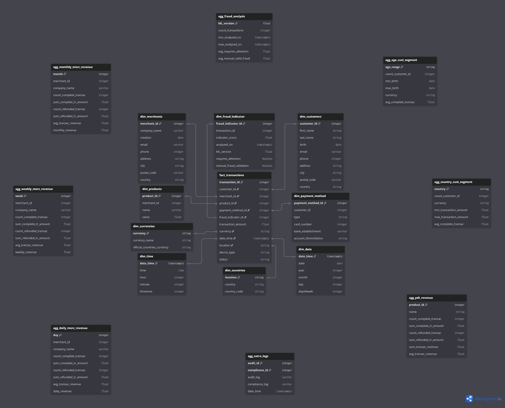

Let's move on to our OLAP with its star schema!

The way our architecture is set, the OLAP is a middle point between OLTP & noSQL. Given the OLTP's optimization for writing, analysts need a dedicated component for reading the data: that is the OLAP. Its optimization for reading, as well as its ACID properties would make it the most reliable source of data for our analysts; the solution we would resort to is Amazon's Redshift.

---

### Fact and dimension tables

A single **fact table** can be found at the center: while it stores keys to which all other tables can connect to (with one exception to be mentioned below), it also stores the core metric that is the transaction amount. For the sake of a visual representation, all **dimension tables** surround it on purpose: as the wealth of informations per transaction is heavy, our pipelines from the upstream systems spread all fields throughout these dimension tables including near-static data (such as countries). These tables may not on their own answer all business questions, but this is where we want to think about aggregation tables and views.

---

### Aggregation tables

While dimension tables may satisfy simpler requests such as filtering transactions based on a date, let's focus on the need for **aggregation tables**. More complex questions, such as "how much revenue did this product generate?" would require assembling multiple criterias: in this example, we would resort to our product_id as the primary key identifying said product, thus making it possible with a filter to compute the sum of transaction amounts, filtering further by the status of "completed". It could be expanded by also recovering the sum behind refunded transactions with more filters, in order to compute the real net revenue.

---

### Limitations

This is one heavy **limitation** of the system proposed here: aggregations are necessary to address such complex business questions. Examples are provided with customer segmentation (by country or age range, the latter would take a separate computation based on transformations of the birth date), merchant's revenue (daily/weekly/monthly) and with a heavier aggregation of data pertaining to our machine learning, in the idea of "how efficient was this given model version at identifying actual frauds?" tracking manual markings of real frauds to compare against the model's predictions.

Finally, the last aggregation table follows one expectation from our project instructions: an entry point for audit and compliance logs. Those would likely be produced outside the database itself, yet stored into the OLAP for its ACID properties given how precious these logs could be.

Of course, more aggregation tables or views could be produced to meet business needs! The list could go on at length, sadly meeting one reality: the limitation in vertically scaling the database, as well as its cost.

This is it for our OLAP!