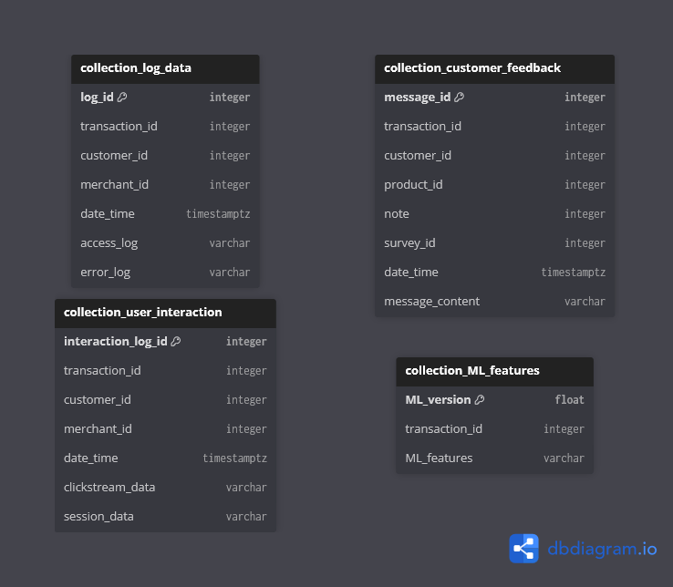

This time, let's observe what our pipelines feed our noSQL component with, that our OLTP cannot reasonably handle!

As we resort to MongoDB, our noSQL system is thus based on a document-oriented database. This one will at least offer the four collections expected by our instructions: log data, customer feedback, user interaction and ML features.

As the focal point of our system, its objective from its BASE properties is to eventually inherit the ACID properties upstream. With a higher availability and easier scaling, this noSQL component will have more ease facing traffic spikes than the OLTP/OLAP. On top of it, its flexible schemas can meet with more ease business questions!

---

### Log data

Anyway, let's first review what our **log data** would be storing: a new transaction would generate a new document in this collection by creating an unique identifier, storing the ids of the related transaction and either merchant (initiating a refund for a customer) or customer's id (all other cases), providing the date & time (with timezone) at which the two following logs are produced: the system access and any error log where applicable.

```
{
    "log_id" : "log...dmj",
    "transaction_id" : "tra...4uy",
    "customer_id" : "cus...gr8",
    "merchant_id" : "mer...iq0",
    "date_time" : "2026-01-15 21:10:18.000431",
    "access_log" : [
        ...
    ],
    "error_log" : [
        ...
    ]
}
```

---

### Customer feedback

Next comes our **customer feedback**: whichever the nature of the customer message, since our system revolves around transactions we will presume this feedback is made available straight after paying. Thus we will want to uniquely identify the message, have it associated to the transaction's id and recover the customer's own id; then our feedback branches off into two possibilities following our instructions. It could be a product review, at which point we want the associated product's id and possibly a note for rating; or it could be the reply to a survey, at which point said survey should have its own unique id to be identified. In any case the feedback should have its own date & time (with timezone), and obviously provide in a column the full message's content.

```
{
    "message_id" : "mes...mh1",
    "transaction_id" : "tra...ws7",
    "customer_id" : "cus...vnb",
    "product_id" : "pro...055",
    "note" : "4",
    "survey_id" : "sur...a3p",
    "date_time" : "2021-10-18 09:46:20.000129",
    "message_content" : [
        ...
    ]
}
```

---

### User interaction

Then for our **user interaction**: on each transaction generated, the system should be able to recover all interaction data associated to it. Thus it would produce an interaction log with its unique id, storing the related transaction's id, the user id (either the merchant's when initiating a refund, either the customer in all other cases - generating an empty field for the case that doesn't apply for consideration by our downstream pipelines), the date & time (with timezone) when was this data generated, and both logs associated to the user interaction: their clickstream and the session data.

```
{
    "interaction_log_id" : "inl...230",
    "transaction_id" : "tra...du8",
    "customer_id" : "cus...7d4",
    "merchant_id" : "mer...0qw",
    "date_time" : "2024-07-21 12:30:51.000537",
    "clickstream_data" : [
        ...
    ],
    "session_data" : [
        ...
    ]
}
```

---

### ML features

Finally, our **ML features** collection would be fed straight by our fraud detection app, by recovering the model's version as its identifier, the associated transaction id to the analysis, and the variety of features used in the detection.

```
{
    "ML_version" : "production_v42",
    "transaction_ID" : [
        "tra...95d", "tra...b60", "tra...f7t"
    ],
    "ML_features" : {
        "model" : "LogisticRegression",
        "parameters" : {
            "penalty" : "l1",
            "C" : "0.1",
            "random_state" : "42"
        }
    }
}
```

More collections can be created, their contents inherited straight from the OLTP/OLAP upstream. Given mongoDB enables a lot more flexibility to meet business questions, there could be many more collections added later on!

That's it for our noSQL!