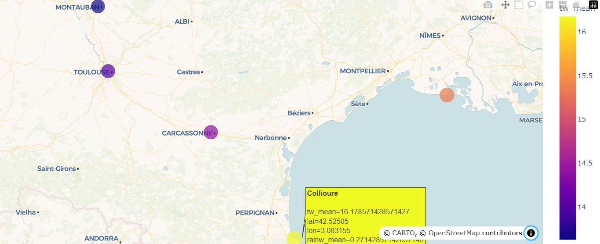
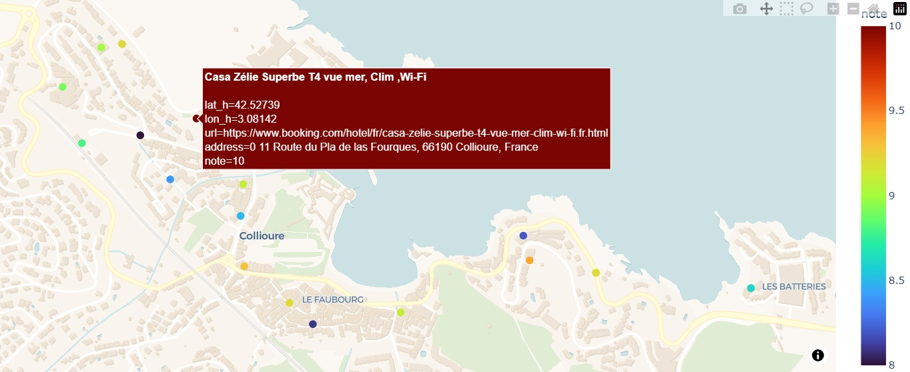

# :book: Kayak: the docs

### :bookmark: Table of contents

1. [The tools](#hammer_and_wrench-the-tools)
2. [The files](#books-the-files)
3. [The reasoning](#thought_balloon-the-reasoning)

---

### :hammer_and_wrench: The tools

* Environment manager: Anaconda
* Environment: see the `.yaml` file
* IDE: VScode
* Data warehouse: [Neon](https://neon.com/)

### :books: The files

You may find in this repository's root:

* The `.ipynb` notebook storing all the work for this project, following a logical read and calling external scripts when needed;
* An instructions file `.env_example.md` to create your confidential environment variables;
* The `.yaml` file storing the environment's specs to run the notebook.

You will find under the `src` folder:

* The `booking_url_hotel.py` script gathering 20 relevant hotel URLs for each destination,
* The `booking_info_hotel.py` script scraping each hotel URL to gather the data we need to produce our recommendations.

Finally, the `data` folder stores all `.json` and `.csv` results from the various steps of data collection and transforming.

### :thought_balloon: The reasoning

* **Pre-requisites**

The notebook contains a narrative to walk the reader step-by-step through the work that was done here; the travel recommendation produced are found at the very end. Still, here is the summary of how it all went:

First is setting up the environment and variables; you may have to create accounts on external services for API calls. Note that all tools used here are on a freemium economical model; this project remains within free tiers, unless you otherwise use said services for more activities. The `.env_example.md` file will tell you more about them.

* **GPS coordinates and weather data**

Now, the starting point for our project is a list of destinations. We want their GPS coordinates; geopy's Nominatim will provide these, allowing us then to request weather data from the French public weather service - Météo France.

The content provided by Météo France being huge, we select what will become later our criterias to enjoy a trip: lower rain volumes and higher temperatures.

* **A first visualisation: the top5 destinations**

Keeping in mind the project was done back in late autumn/early winter 2025, we can already produce locally a first recommendation with our top5 destinations:

As a reminder, our criterias are lower rain volumes ("rainw_mean" for weekly rain volumes on average) and higher temperatures ("tw_mean" for weekly temperatures on average). Still, with few API calls we already have a first recommendation to provide!

* **Scraping hotels data**

Technically, this is where the most effort goes to. The two spiders (bots for scraping data) provided as scripts under the `src` folder take some time to complete, but allow us to recover the hotels' informations from Booking's website.

The first spider allows us to recover 20 hotels' URLs for each destination, while the second allows us to check each URL's content to recover the informations we are interested in: the location, the address, name, note, description and again the target URL.

* **Harmonizing our data**

With he location (such as the Gorges du Verdon or the city of Carcassonne) being in common throughout our files, we can merge them to produce a single, comprehensive file as our dataset for the next recommendation!

A few finishing touches are still required to bring order to chaos, but we're reaching the end of this work: since geopy's Nominatim isn't so accurate as to extract GPS coordinates for a precise address, we make use of HERE's API to handle this part.

* **Pushing the data to the cloud**

With our data ready, following our instructions we are expected to load it to & from a data warehouse; this is where we used AWS.

Knowing the table's structure as its producers, we can now use simple SQL queries to produce our top20 hotels!

* **The second visualisation: the top20 hotels**

Using the note of each hotel as our classifying criteria, a simple color code lets us then highlight the best hotels recommendations in Collioure, the earlier leader of our top 5 for destinations:

The advantage of reading this content through the notebook is having interactive displays with the visualisations. Anyway, this wraps up our work on this project; thanks for reading!