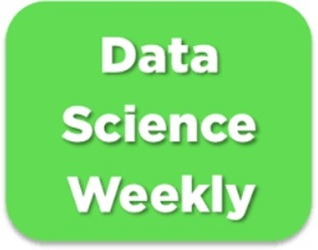

    

*[English translation](#uk-machine-learning) follows below.*

# 
Certification CDSD - bloc 3 Machine learning :fr:

### 
Jedha: projet Conversion rate

 

*Tous droits intellectuels applicables appartiennent à leurs propriétaires respectifs. Le contenu ici présent est exclusivement mis à disposition dans le cadre du diplôme d'état RNCP35288 ou pour candidature à un emploi.*

Bienvenue dans mon repo dédié au projet Conversion rate, pour la certification CDSD Jedha!

### :email: Le thème

*Newsletter* supervisée par des data scientists indépendants, Data Science Weekly souhaite comprendre le comportement de ses utilisateurs. L'idée consiste à produire un modèle prédisant la souscription d'un utilisateur à la *newsletter* en disposant d'un nombre restreint d'informations; l'analyse de ces paramètres permettrait alors de faire ressortir les facteurs les plus importants dans la décision afin d'augmenter le taux de conversion.

### :dart: L'objectif

Produire ce modèle prédictif explicitant les principaux facteurs associés à la conversion client.

### :boxing_glove: Les challenges

* Exploiter une quantité minimale d'informations

* Faire usage d'un dataset à distribution très largement inégale

* Mettre en évidence les paramètres principaux du modèle

### :grey_question: Le fonctionnement

Veuillez vous reporter au dossier `docs`, expliquant le contenu de ce repo (disponible en :uk: anglais uniquement).

Bonne exploration! :feet:

---

# 
:uk: Machine learning

### 
Jedha: Conversion rate project

 

*All applicable intellectual property rights belong to their rightful owners. The content herein displayed is exclusively provided for the sake of the French professional certification RNCP35288 or for job applications.*

Welcome to my repository dedicated to the Conversion rate project, for Jedha's certification!

### :email: The theme

Newsletter curated by independant data scientists, Data Science Weekly wants to better understand its users behaviour. The team would like to have a model able to predict whether an user would subscribe to the newsletter using a limited amount of informations; the analysis of its main parameters would then possibly enable the discovery of a new lever for action to improve the conversion rate.

### :dart: The objective

Produce a predictive model by clarifying what are the main parameters associated to customer conversion.

### :boxing_glove: The challenges

* Make use of a minimal amount of informations

* Manipulate a dataset with a heavily uneven distribution

* Explain the most important parameters of the model

### :grey_question: The functioning

Please refer to the `docs` folder, detailing this repository's contents and the reasoning.

Have fun exploring! :feet: