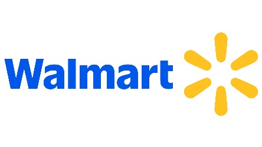

    

*[English translation](#uk-machine-learning) follows below.*

# 
Certification CDSD - bloc 3 Machine learning :fr:

### 
Jedha: projet Walmart

 

*Tous droits intellectuels applicables appartiennent à leurs propriétaires respectifs. Le contenu ici présent est exclusivement mis à disposition dans le cadre du diplôme d'état RNCP35288 ou pour candidature à un emploi.*

Bienvenue dans mon repo dédié au projet Walmart, pour la certification CDSD Jedha!

### :shopping_cart: Le thème

Chaîne multinationale de vente au détail basée aux États-Unis, Walmart souhaite faire usage de la data science afin de déterminer quels facteurs économiques influencent les ventes hebdomadaires, afin d'adapter en conséquence leurs campagnes marketing.

### :dart: L'objectif

Produire un modèle prédictif de vente, basé sur une régression régularisée afin de combattre le surapprentissage.

### :boxing_glove: Les challenges

* Travailler un dataset où de certaines données sont inexploitables en l'état

* Se prémunir contre le surapprentissage

* Identifier clairement les facteurs influençant les ventes hebdomadaires

### :grey_question: Le fonctionnement

Veuillez vous reporter au dossier `docs`, expliquant le contenu de ce repo (disponible en :uk: anglais uniquement).

Bonne exploration! :feet:

---

# 
:uk: Machine learning

### 
Jedha: Walmart project

 

*All applicable intellectual property rights belong to their rightful owners. The content herein displayed is exclusively provided for the sake of the French professional certification RNCP35288 or for job applications.*

Welcome to my repository dedicated to the Walmart project, for Jedha's certification!

### :shopping_cart: The theme

Walmart Inc. is an American multinational retail corporation, interested in data science to better understand which economic indicators influence their weekly sales. Doing so would help the company with planning their future marketing campaigns.

### :dart: The objective

Produce a model to predict weekly sales, based on a regularized regression to deal with overfitting.

### :boxing_glove: The challenges

* Work on a dataset including data that cannot be used as-is

* Fight against overfitting

* Clearly identify the parameters influencing weekly sales

### :grey_question: The functioning

Please refer to the `docs` folder, detailing this repository's contents and the reasoning.

Have fun exploring! :feet: