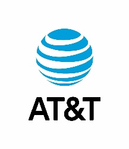

      

*[English translation](#uk-machine-learning) follows below.*

# 
Certification CDSD - bloc 4 Deep learning :fr:

### 
Jedha: projet AT&T

 

*Tous droits intellectuels applicables appartiennent à leurs propriétaires respectifs. Le contenu ici présent est exclusivement mis à disposition dans le cadre du diplôme d'état RNCP35288 ou pour candidature à un emploi.*

Bienvenue dans mon repo dédié au projet AT&T, pour la certification CDSD Jedha!

### :iphone: Le thème

Poids lourd des télécoms aux États-Unis, AT&T est constamment exposé au problème des spams dans le trafic de ses messages.

Si l'entreprise parvient à marquer manuellement ces messages pour empêcher leur diffusion, elle cherche un moyen de détection automatisé pour faire face au volume.

### :dart: L'objectif

Produire un modèle capable de marquer ces fameux messages comme spam ou non, selon leur contenu.

### :boxing_glove: Les challenges

* Utiliser la technologie du deep learning

* Explorer un dataset sans explication de sa structure

* Présenter concrètement les performances de chaque modèle et leur impact sur les clients

### :grey_question: Le fonctionnement

Veuillez vous reporter au dossier `docs`, expliquant le contenu de ce repo (disponible en :uk: anglais uniquement).

Bonne exploration! :feet:

> [!NOTE]
> Le code et l'environnement sont conçus pour réaliser l'entraînement sur GPU!

---

# 
:uk: Deep learning

### 
Jedha: AT&T project

 

*All applicable intellectual property rights belong to their rightful owners. The content herein displayed is exclusively provided for the sake of the French professional certification RNCP35288 or for job applications.*

Welcome to my repository dedicated to the AT&T project, for Jedha's certification!

### :iphone: The theme

AT&T is a multinational telecommunications holding company based in the United States, its customers being constantly exposed to the issue of spam messages.

Although AT&T has been able to manually flag spam messages, the company is looking for an automated way to detect spams to deal with the traffic volume.

### :dart: The objective

Produce a spam detection model, marking messages when adequate depending on their content.

### :boxing_glove: The challenges

* Use deep learning technology

* Explore a given dataset without details about its structure

* Explain each model's performances and their impact on customers

### :grey_question: The functioning

Please refer to the `docs` folder, detailing this repository's contents and the reasoning.

Have fun exploring! :feet:

> [!NOTE]
> Both the code & environment are made to run the training on your GPU!