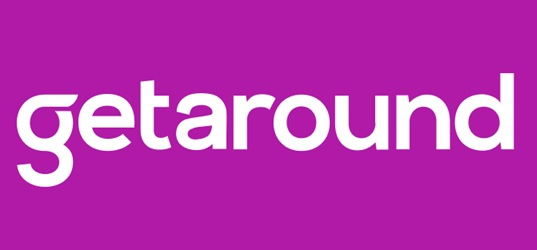

     

*[English translation](#uk-deployment) follows below.*

# 
Certification CDSD - bloc 5 Déploiement :fr:

### 
Jedha: projet GetAround

 

*Tous droits intellectuels applicables appartiennent à leurs propriétaires respectifs. Le contenu ici présent est exclusivement mis à disposition dans le cadre du diplôme d'état RNCP35288 ou pour candidature à un emploi.*

Bienvenue dans mon repo dédié au projet GetAround, pour la certification CDSD Jedha!

### :car: Le thème

GetAround est une plateforme de location de voiture liant directement client et propriétaire, pour une durée locative complètement personnalisable.

Pour louer une voiture, les utilisateurs suivent un procédé de réservation puis de retour du véhicule propre à la plateforme, où le contrat liant chaque partie prend essentiellement deux formes: l'une ("mobile agreement") impose une rencontre physique où chaque partie prenante signe un contrat sur le téléphone du propriétaire, l'autre ("connect") permet au conducteur de directement déverrouiller le véhicule avec son smartphone sans avoir à passer par le propriétaire.

Cependant, le service client évoque le mécontentement évident aussi bien des clients que des propriétaires lors de réservations en chaîne avec un retour en retard du véhicule, impactant inévitablement la prochaine location - au point d'entraîner parfois des annulations voire même des litiges lorsque les parties prenantes se rencontrent.

### :dart: L'objectif

Pour mitiger l'impact de tels phénomènes, l'entreprise décide d'implémenter un délai minimal entre deux réservations consécutives. S'il s'agit d'une solution partielle pour la satisfaction client, les revenus générés pour les propriétaires comme la plateforme s'en ressentiront: un équilibre doit être trouvé.

Notre product owner nous sollicite pour mieux cerner l'impact de chaque créneau espaçant deux réservations, ainsi que l'impact selon le format du contrat de réservation (avec ou sans rencontre entre le conducteur et le propriétaire).

### :boxing_glove: Les challenges

* Fournir des dashboards d'analyse business,

* Servir une API permettant la prédiction de tarifs de réservation selon la fiche technique du véhicule,

* Fournir la documentation de cette même API.

Retrouvez les liens dans l'encart "Tip" ci-dessous!

### :grey_question: Le fonctionnement

Veuillez vous reporter au dossier `docs`, expliquant le contenu de ce repo (disponible en :uk: anglais uniquement).

Bonne exploration! :feet:

> [!TIP]
> Vous parviendrez sous [ce lien](https://mevelios-getaround-projectm174.hf.space) produit par HuggingFace au dashboard de l'application. Vous trouverez également sous [cet autre lien](https://mevelios-getaround-projectn174.hf.space/docs) la documentation associée à son API; veuillez noter cependant que le service d'hébergement peut nécessiter une minute pour redémarrer, puisqu'il tourne sur des ressources gratuites!

---

# 
:uk: Deployment

### 
Jedha: GetAround project

 

*All applicable intellectual property rights belong to their rightful owners. The content herein displayed is exclusively provided for the sake of the French professional certification RNCP35288 or for job applications.*

Welcome to my repository dedicated to the GetAround project, for Jedha's certification!

### :car: The theme

GetAround is a car rental platform putting directly in relation the driver with the car owner, for a customizable rental duration.

To rent a car, users have to go through booking and returning processes following the platform's instructions, bound by contracts of mostly two formats: the first ("mobile agreement") makes both driver and owner meet to sign the rental contract on the owner's smartphone, while the second ("connect") lets the driver directly open the car using their smartphone without meeting the owner.

Still, the customer service reports the dissatisfaction from both customers and owners during consecutive rentals where the car is returned late, unavoidably impacting the next rental - so much that it leads either to cancellations, either to conflicts when involved parties may still meet.

### :dart: The objectives

In order to mitigate those issues, the company intends on introducing delays between consecutive rentals. Although it is a partial solution to customer dissatisfaction, it would also impact revenues for both the owners and the platform: we need the right trade-off.

Our product owner still needs to decide which threshold makes for the best compromise on consecutive rentals, and would also like to better understand the impact depending the type of rental contract (with or without the driver and owner meeting).

### :boxing_glove: The challenges

* Provide dashboards with business analyses,

* Serve an API enabling predictions of rental costs depending the vehicle specs,

* Provide the documentation of this same API.

Find the links to these resources in the "Tip" section below!

### :grey_question: The functioning

Please refer to the `docs` folder, detailing this repository's contents and the reasoning.

Have fun exploring! :feet:

> [!TIP]
> Please use [this link](https://mevelios-getaround-projectm174.hf.space) produced by HuggingFace to access the app dashboard. You also can access through [this other link](https://mevelios-getaround-projectn174.hf.space/docs) the documentation associated to its API; please note the hosting service may need to be restarted first, since it runs on free resources!